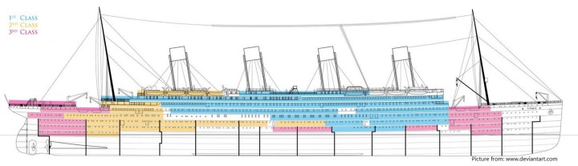

  
```{r setup, include=FALSE}
knitr::opts_chunk$set(echo = TRUE)
```
# Background
The sinking of the Titanic is one of the most infamous shipwrecks in history.

On April 15, 1912, during her maiden voyage, the widely considered “unsinkable” RMS Titanic sank after colliding with an iceberg. Unfortunately, there weren’t enough lifeboats for everyone onboard, resulting in the death of 1502 out of 2224 passengers and crew.

While there was some element of luck involved in surviving, it seems some groups of people were more likely to survive than others.

In this challenge, we ask you to build a predictive model that answers the question: “what sorts of people were more likely to survive?” using passenger data (ie name, age, gender, socio-economic class, etc).

# Data Set Reference
https://www.kaggle.com/c/titanic/ 

# The Code
## Reading Dataset
Let's start by reading data train in the 'titanic' dataset and check the frame:
```{r}
titanic <- read.csv("train.csv")
head(titanic)
```
## Exploratory Data Analysis
### Data Inspection
Checking the data type
```{r}
summary(titanic)
```
### Data Cleansing
Convert data type so we can calculate better
```{r}
titanic$Sex <- as.factor(titanic$Sex)
titanic$Embarked <- as.factor(titanic$Embarked)
```

check if there is/are missing value(s) in data frame
```{r}
anyNA(titanic)
```

Check total missing value in every columns
```{r}
colSums(is.na(titanic))
```
Set value for missing value by the mean and check again any missing value
```{r}
mean_age <- mean(titanic$Age)
titanic$Age[is.na(titanic$Age)] <- mean_age
colSums(is.na(titanic))

```

### Aggregation an Plotting
#### Survivor by Sex
```{r}
agg_sex <- table(titanic$Survived, titanic$Sex)
prop.table(agg_sex)*100
barplot(agg_sex)
library(ggplot2)
ggplot(data=titanic, aes(Sex, fill = factor(Survived))) + geom_bar(stat = "count", position = "dodge") + xlab("Sex") + scale_fill_discrete(name = "Survived") + ggtitle("Survivors by Sex")
```
#### Survivor by Age
```{r}
agg_age <- table(titanic$Survived, titanic$Age)
prop.table(agg_age)*100
barplot(agg_age)

ggplot(data=titanic, aes(Age, fill = factor(Survived))) + geom_histogram(bins = 30) + xlab("Age") + scale_fill_discrete(name = "Survived") + ggtitle("Survivors by Age")
```
#### Survivors by Number of Siblings
```{r}
ggplot(data=titanic, aes(SibSp, fill = factor(Survived))) + geom_bar(stat = "count", position = "dodge") + xlab("Siblings") + scale_fill_discrete(name = "Survived") + ggtitle("Survivors by Number of siblings")
```
#### Survivors by Number of Parents or Children
```{r}
ggplot(data=titanic, aes(Parch, fill = factor(Survived))) + geom_bar(stat = "count", position = "dodge") + xlab("Parents and Children") + scale_fill_discrete(name = "Survived") + ggtitle("Survivors by Number of Parents or Children")
```
#### Survivors by Family Members
```{r}
ggplot(data=titanic, aes(Parch+SibSp, fill = factor(Survived))) + geom_bar(stat = "count", position = "dodge") + xlab("Family members") + scale_fill_discrete(name = "Survived") + ggtitle("Survivors by Number of Family members")
```
#### Survivors by Passengers Class
```{r, out.width = "100%", echo = FALSE, fig.align = "center"}


ggplot(data=titanic, aes(Pclass, fill = factor(Survived))) + geom_bar(stat = "count", position = "dodge") + xlab("Pclass") + scale_fill_discrete(name = "Survived") + ggtitle("Survivors by Passenger class")
```
#### Survivors by Ticket Fare
```{r}
ggplot(data=titanic, aes(Fare, fill = factor(Survived))) + geom_histogram(bins = 5) + xlab("Fare") + scale_fill_discrete(name = "Survived") + ggtitle("Survivors by Ticket Fare")
```

#### Summary Probability
```{r}
library(gtsummary)
train2 <- titanic %>% select(Survived, Sex, Pclass, SibSp, Parch, Embarked)
train2 %>% tbl_summary(by = Survived)
```

